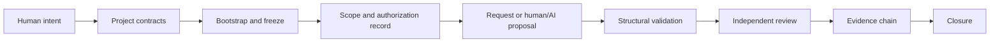

# How the Rail Works

## Purpose

This is an explanation of the public contract flow. The normative details are
the JSON schemas, templates, and validator behavior; this document explains
why the pieces exist. The public CLI validates supplied files and does not
call a model, execute tools, or apply a change.

## Contract flow

The flow is a record of bounded preparation. An adopter may connect it to a
separate control or execution plane, but this public kit does not supply that
plane.

## The important terms

### Intent

An `intent` states the one bounded outcome under discussion. It gives later
records a stable identifier and prevents unrelated work from being silently
attached to the same task.

### Decision owner

The `decision owner` is the human who can authorize, reject, or narrow the
project decision. The public validator can check the declared reference and
human-only role invariant; it cannot verify a person's real-world identity.

### Authority source

An `authority source` is an adopted project contract or decision record that
the request explicitly cites. README text, issue text, and arbitrary JSON
values are not automatically authority sources.

### Bootstrap

`Bootstrap` maps neutral templates to one host repository. It records project
identity, owner, boundaries, selected modules, change surfaces, and review
metadata. `freeze` creates the manifest used to detect later document changes.

### Bootstrap states

- `UNPACKED`: the target exists, but project truth is not written.
- `SEEDED`: identity, purpose, owner, and initial module context are recorded.
- `MAPPED`: boundaries, conventions, integration points, and surfaces are
  mapped.
- `READY`: the active documents, frozen manifest, and bootstrap review are
  structurally coherent.
- `BLOCKED`: a required fact is missing, conflicting, stale, or unsafe.

The CLI may return `STRUCTURALLY_VALID`,
`AUTHORIZATION_RECORD_CONSISTENT`, or `EVIDENCE_CHAIN_VALID` for later
checks. These are validation results, not execution permissions.

### Request and authorization record

A `request` binds an actor, role, action mode, selected modules, change
surfaces, authority sources, and scope to a frozen bootstrap manifest. An
`authorization` record is checked for local consistency, including intent,
workspace, owner reference, scope hash, and time window. It is not a signed
identity assertion in the public profile.

### Output and review

An `output` describes the proposed artifacts and change kinds. The validator
checks declared paths against the request scope and requires
`execution_capability: false`. A `review` is a separate result, not an
extension of the requester's authority. A reviewer can reject the proposal.

### Evidence chain and closure

The `evidence` chain links intent, authorization, proposed output, review, and
closure in order. Type-specific schemas bind IDs and hashes where the public
profile can do so. A `closure` records how the review ended; it does not prove
that an external deployment, command, or human identity was correct.

## Boundaries that must stay explicit

- `READY` is not execution authorization.
- A role is not an identity.
- A hash proves integrity of bytes, not truth of content.
- Valid JSON proves contract shape, not a sound decision.
- Model qualification evidence is supplied evidence, not a production model
  approval or an evaluation runtime.

## Read next

- [Quickstart](../QUICKSTART.md) for the smallest English tutorial.
- [First Czech pilot](./cs/PRVNI-PILOT.md) for a more explanatory walkthrough.
- [Operational reference profile](./OPERATIONAL-REFERENCE-PROFILE.md) for the
  portable role and module vocabulary.
