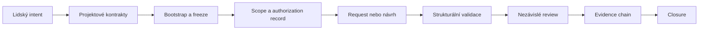

# Jak to funguje

Tento dokument vysvětluje veřejný contract flow. Normativní význam mají
schémata, šablony a skutečné validační chování; tento text je explanation.
CLI ověřuje dodaná data offline a nespouští model, nástroj ani změnu.

## Celý tok



## Pojmy v pořadí toku

### `intent`

`intent` je jeden ohraničený záměr. Má identifikátor a účel, aby se k němu
později daly připojit request, output, review a closure. Jeden intent není
volná licence pro všechny související nápady.

### `decision owner`

`decision owner` je člověk s konečnou odpovědností za rozhodnutí. Veřejný
profil kontroluje deklarovaný odkaz a zakazuje AI jako `System Architect`, ale
neověřuje občanskou nebo organizační identitu.

### `authority source`

`authority source` je explicitně citovaný aktivní projektový kontrakt nebo
decision record. README, issue, starý dokument a libovolná JSON hodnota nejsou
automaticky autorita.

### `bootstrap`

`bootstrap` přizpůsobí neutrální šablony jednomu hostitelskému repozitáři.
Zaznamená workspace, ownera, účel, hranice, moduly, change surfaces a review.
`freeze` uloží hash autoritativních dokumentů.

### Stavy

- `UNPACKED` — soubory existují, ale hostitelská pravda není vyplněná;
- `SEEDED` — je zapsaná identita, účel, owner a základní mapování;
- `MAPPED` — jsou jasné hranice, konvence, integrace a change surfaces;
- `READY` — aktivní dokumenty, manifest a bootstrap review jsou konzistentní;
- `BLOCKED` — něco chybí, je v konfliktu, prošlé nebo nebezpečné.

Stav `READY` není execution authorization. Přítomnost souborů sama nestačí.
Změna zmrazeného dokumentu stav zneplatní.

### `request` a `authorization record`

`request` spojuje actor, roli, action, scope, moduly, change surfaces,
authority sources a hash bootstrap manifestu. `authorization record` se ve
veřejném profilu kontroluje na lokální konzistenci, včetně owner reference,
scope hashe a časové platnosti. Není to důkaz podepsané lidské identity.

### `output` a `review`

`output` popisuje navrhované artefakty a druhy změn. Validator kontroluje cesty
proti scope a vyžaduje `execution_capability: false`. `review` je nezávislý
výsledek; reviewer může návrh schválit pro další lokální proces nebo odmítnout.

### `evidence chain` a `closure`

Evidence řetězí intent, authorization, proposed output, review result a
closure. Kontroluje pořadí, ID, workspace, hashy a některé typové vazby.
`closure` popisuje, jak review skončilo. Hash ani validní JSON nepotvrzují, že
externí účinek skutečně proběhl správně.

## Co z těchto stavů neplyne

```text
READY ≠ povolení k vykonání
role ≠ ověřená identita
správný hash ≠ správný obsah
validní JSON ≠ pravdivé rozhodnutí
model evaluation evidence ≠ produkční schválení modelu
```

Interní nebo host-project control plane musí samostatně řešit identitu,
capability, tool broker, sandbox, secrets, síť, skutečný diff a postconditions.

## Další čtení

- [První pilot](./PRVNI-PILOT.md) — konkrétní cesta přes offline CLI.
- [Bezpečnostní hranice](./BEZPECNOSTNI-HRANICE.md) — praktické bezpečnostní
  příklady.
- [Anglická technická explikace](../HOW-THE-RAIL-WORKS.md) — stručná reference.
